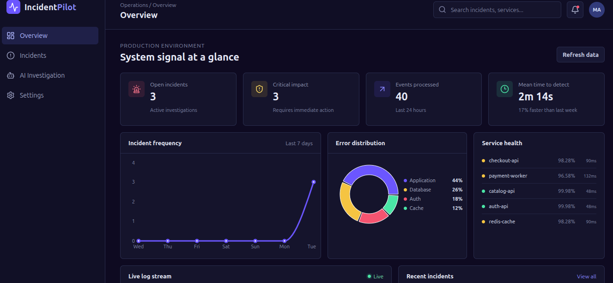
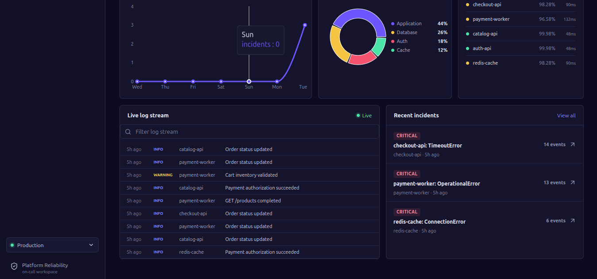
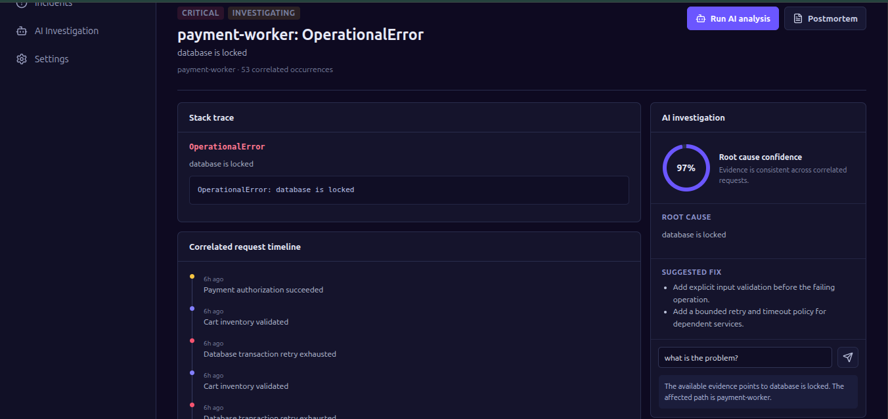

## 🏆 Quick Start for Judges

The fastest way to evaluate **IncidentPilot** is with **GitHub Codespaces**—no local setup required.

1. Click **Code** → **Codespaces** → **Create codespace on main**.
2. Open two terminals.

**Terminal 1 – Backend**

```bash
cd backend
source venv/bin/activate
uvicorn main:app --reload --host 0.0.0.0 --port 8000
```

**Terminal 2 – Frontend**

```bash
cd frontend
npm run dev -- --host 0.0.0.0
```

Once both services are running, open the forwarded Vite port (typically **5173**) to access the IncidentPilot dashboard.


# IncidentPilot

> **AI-Powered Incident Investigation & Root Cause Analysis**

IncidentPilot is an AI-assisted incident response platform built for software engineers, DevOps teams, and Site Reliability Engineers (SREs).

Instead of manually searching through thousands of log lines after a production failure, IncidentPilot reconstructs the incident timeline, correlates evidence, identifies affected services, and explains the most likely root cause using an  Large Language Model.

For demonstration purposes, the repository includes a deliberately faulty FastAPI e-commerce backend capable of generating realistic production incidents.

---

# Dashboard



---

# The Problem

When production systems fail, engineers typically investigate multiple independent sources:

- Application logs
- Stack traces
- Request IDs
- Correlation IDs
- Service failures
- Deployment events
- Infrastructure metrics

Finding **the root cause** often takes significantly longer than identifying the initial exception.

IncidentPilot automates this investigation by reconstructing incidents from structured evidence before involving an AI model.

---

# Features

## Deterministic Investigation

Works without AI.

- Live log viewer
- Structured log parser
- Incident detection
- Request correlation
- Correlation ID tracking
- Timeline reconstruction
- Stack trace extraction
- Service health monitoring
- Error distribution
- Search & filtering
- Recent incidents
- Evidence visualization

---

## AI Investigation

Uses an   -LLM model **only after deterministic analysis**.

The AI generates:

- Executive summary
- Root cause analysis
- Chain of evidence
- Confidence score
- Affected services
- Suggested fixes
- Recommended next steps
- Incident postmortem
- Interactive follow-up answers

Rather than uploading an entire log file, IncidentPilot extracts only the relevant structured evidence surrounding the incident.

---

# Demo Architecture

```text
                        ┌─────────────────────────────┐
                        │ Faulty Commerce Backend     │
                        │ FastAPI                     │
                        └─────────────┬───────────────┘
                                      │
                         Structured Production Logs
                                      │
                                      ▼
                        ┌─────────────────────────────┐
                        │ Log Parser                  │
                        │ Incident Detector           │
                        │ Timeline Builder            │
                        │ Stack Trace Extractor       │
                        │ Request Correlator          │
                        └─────────────┬───────────────┘
                                      │
                     Structured Incident Context
                                      │
              ┌───────────────────────┴───────────────────────┐
              │                                               │
              ▼                                               ▼
     Deterministic Dashboard                                 LLM
              │                                               │
              └───────────────────────┬───────────────────────┘
                                      ▼
                             IncidentPilot Dashboard
```

---

# Project Components

## 1. Faulty Commerce Backend

A FastAPI-based e-commerce application intentionally contains multiple realistic production failures.

### Commerce Modules

- Authentication
- Products
- Cart
- Orders
- Checkout
- Payments
- Admin

### Seeded Production Bugs

- Missing JSON field
- Invalid JWT
- Database timeout
- Divide-by-zero
- Missing environment variable
- File permission failure
- Redis unavailable (mocked)
- Malformed payload

Every failure produces realistic production-style structured logs.

Each request records:

- Timestamp
- Request ID
- Correlation ID
- Endpoint
- User ID
- HTTP Method
- Response Status
- Latency
- Log Level
- Stack Trace (when applicable)

A background traffic generator continuously creates realistic operational noise so incidents resemble real production systems.

---

## 2. IncidentPilot Dashboard



The dashboard continuously parses structured logs and reconstructs incidents.

Dashboard includes:

- Incident Overview cards
- Live Log Stream
- Service Health panel
- Incident Timeline
- Error Distribution
- Response Latency
- Recent Incidents
- Search
- Filters
- Stack Trace Viewer
- Correlated Requests
- AI Investigation Panel

---

# AI Investigation



Selecting **Analyze Incident** sends only the structured evidence surrounding the incident to an Cloud Ai model.

The AI produces:

- Executive Summary
- Root Cause Analysis
- Chain of Evidence
- Confidence Score
- Suggested Fix
- Recommended Next Steps
- Incident Postmortem

This approach minimizes token usage while improving explanation quality.

---

# Demo Workflow

1. Start the FastAPI backend.
2. Trigger one of the intentionally seeded failures.
3. Structured logs are written.
4. IncidentPilot detects the incident.
5. Dashboard updates automatically.
6. Open Incident Details.
7. Review deterministic evidence.
8. Click **Analyze Incident**.
9. AI explains the incident.
10. Generate an incident postmortem.

---

# Project Architecture

## Backend

- FastAPI
- SQLModel
- SQLite
- Structured Logging

## Frontend

- React
- TypeScript
- Vite
- Recharts
- Axios
- Lucide React
- Plain CSS

## AI

Uses the official OpenAI SDK.

Examples:

- OpenAI
- Fireworks AI

Switching providers only requires changing environment variables.

---

# Project Structure

```text
incident-pilot/
├── README.md
├── assets/
│   ├── dashboard-overview.png
│   ├── dashboard-activity.png
│   └── ai-investigation.png
│
├── backend/
│   ├── main.py
│   ├── requirements.txt
│   ├── tests/
│   └── app/
│       ├── ai/
│       ├── parser/
│       ├── repositories/
│       ├── routers/
│       ├── services/
│       ├── config.py
│       ├── database.py
│       ├── models.py
│       └── schemas.py
│
└── frontend/
    ├── package.json
    ├── vite.config.ts
    ├── public/
    └── src/
        ├── api/
        ├── utils/
        ├── App.tsx
```

---

# Running the Project

## Backend

```bash
cd backend
source venv/bin/activate
uvicorn main:app --reload
```

## Frontend

```bash
cd frontend
npm run dev
```

---

# Environment Variables

Create a `.env` file.

## Fireworks AI

```env
OPENAI_API_KEY=your_fireworks_api_key
OPENAI_BASE_URL=https://api.fireworks.ai/inference/v1
MODEL_NAME=accounts/fireworks/models/minimax-m3
```

## OpenAI

```env
OPENAI_API_KEY=your_openai_api_key
MODEL_NAME=gpt-5.6
```

No application code changes are required when switching providers.

---

# Working Without AI

IncidentPilot remains fully functional without an LLM.

Available features include:

- Incident detection
- Timeline reconstruction
- Request correlation
- Stack trace extraction
- Metrics
- Dashboards
- Evidence visualization

AI enhances investigation by explaining the evidence and producing human-readable analysis.

---

# Building with Codex & GPT-5.6

This project was developed collaboratively using **Codex** and **GPT-5.6**.

## GPT-5.6

GPT-5.6 assisted with:

- Product ideation
- System architecture
- Investigation workflow design
- Feature planning
- User experience decisions
- Prompt engineering
- Documentation refinement

## Codex

Codex accelerated implementation by:

- Generating the FastAPI backend
- Building API routes
- Implementing structured logging
- Creating middleware
- Implementing the log parser
- Building React components
- Creating dashboard layouts
- Wiring frontend and backend APIs
- Implementing AI service integration
- Refactoring modules
- Fixing integration issues
- Generating reusable services
- Maintaining consistent project structure

Human decisions guided the architecture, engineering trade-offs, feature prioritization, and overall product direction.

Codex served as an implementation accelerator rather than replacing software engineering decisions.

---

---

## 🚀 Future Roadmap & Planned Enhancements

While IncidentPilot currently includes a integrated microservices suite for live telemetry and fault injection, future iterations will expand support for arbitrary production infrastructure:

* **📁 Custom Log Ingestion (Drag & Drop):** Support manual upload of `.log`, `.json`, and `.txt` files directly in the dashboard for instant forensic analysis without requiring backend telemetry connections.
* **🔌 Multi-Format Schema Parsers:** Native adapters for popular logging ecosystems, including AWS CloudWatch, Datadog, Syslog, and Kubernetes `kubectl` streams.
* **🔔 Real-Time Incident Alerts:** Webhook integrations to automatically publish AI root-cause summaries and postmortems directly to Slack, PagerDuty, and Microsoft Teams.
* **🛠️ Automated Pull Request Fixes:** Empower AI agents to automatically branch, patch code, and generate GitHub PRs with suggested fixes.
* **📊 Multi-Tenant Collaboration:** Team workspaces with role-based access control (RBAC) for SRE teams conducting joint postmortems.


# License

This project is licensed under the Apache License, Version 2.0 (the "License"). You may not use this file except in compliance with the License. 

